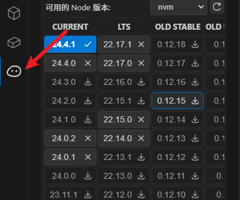
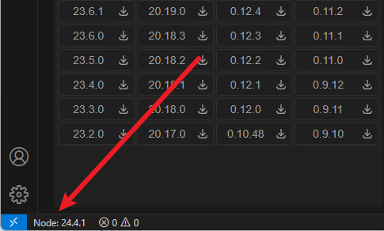
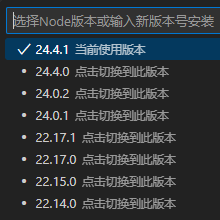

# NVM Node Version Manager

[中文](#chinese) | [English](#english)

# NVM Node 版本管理器

  

    
    
<b>1：侧边栏</b> 在VS Code活动栏中点击此图标打开管理器

  

  

    
    
<b>2：底部状态栏</b> 显示当前Node版本，点击有列表弹窗

  

  

     
    
<b>3：弹窗</b> 弹出窗口显示已安装和可用版本列表

  

### 一个 Visual Studio Code 扩展，基于.nvmrc自动切换Node或手动安装新版本。

## 🚀 安装与使用

### 要求
- 安装 [NVM (Node Version Manager)](https://github.com/nvm-sh/nvm)
- Visual Studio Code 1.97.0 或更高版本

### 安装步骤
1. 通过 VS Code 扩展市场搜索 "NVM Node Switch" 安装

---

[中文](#chinese) | [English](#english)

# NVM Node Version Manager

  

    
    
<b>1: Sidebar</b> Click this icon in VS Code activity bar

  

  

    
    
<b>2: Status Bar</b> Shows current Node version

  

  

    
    
<b>3: Popup</b> Shows installed versions

  

### A Visual Studio Code extension , Auto-switch Node versions on .nvmrc or manually install new node

## 🚀 Installation & Usage

### Requirements
- [NVM (Node Version Manager)](https://github.com/nvm-sh/nvm) installed
- Visual Studio Code 1.97.0 or higher

### Installation
1. Search "NVM Node Switch" in VS Code extensions marketplace
