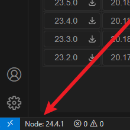

# NVM Node Version Manager

[中文](#chinese) | [English](#english)

# NVM Node 版本管理器

  

    
    
<b>1：侧边栏</b> 在VS Code活动栏中点击此图标打开管理器

  

  

    
    
<b>2：底部状态栏</b> 显示当前Node版本，点击有列表弹窗

  

  

    
    
<b>3：弹窗</b> 弹出窗口显示已安装和可用版本列表

  

一个 Visual Studio Code 扩展，用于通过 NVM (Node Version Manager) 管理 Node.js 版本。

## 主要功能

### 🛠️ 版本管理
- 显示已安装的 Node.js 版本列表
- 一键切换当前使用的 Node.js 版本
- 支持删除已安装的版本
- 显示可用的 Node.js 版本列表
- 支持下载版本
- 状态栏实时显示当前 Node 版本
- 通过状态栏快速切换版本

### 🔍 自动版本检测
- 自动检测工作区中的 `.nvmrc` 文件
- 当 `.nvmrc` 不存在时，检查 `package.json` 中的引擎要求
- 根据项目配置智能推荐 Node.js 版本
- 自动提示创建 `.nvmrc` 文件
- 检测到版本不匹配时提供一键切换功能

### 🌐 多数据源支持
- 从本地 NVM 获取版本列表
- 从 Node.js 官方源获取版本
- 从 npmmirror 镜像源获取版本
- 可自定义添加更多版本源
- 支持动态切换数据源

### ⚙️ 设置管理
- 支持中英文界面切换
- 可配置版本源列表
- 可重置所有设置为默认值

## 🚀 安装与使用

### 系统要求
- 已安装 [NVM (Node Version Manager)](https://github.com/nvm-sh/nvm)
- Visual Studio Code 1.97.0 或更高版本

### 安装步骤
1. 通过 VS Code 扩展市场搜索 "NVM Node Switch" 安装
2. 或从 [GitHub 仓库](https://github.com/FoodGravity/NVMNodeSwitch) 下载并手动安装

### 基本使用
1. 安装扩展后，VS Code 活动栏会出现 "Node Version Manager" 图标
2. 状态栏会显示当前 Node 版本
3. 点击活动栏图标打开管理面板

### 管理面板功能
- **NVM版本**：显示当前 NVM 版本
- **.nvmrc检查**：显示当前项目的 .nvmrc 文件状态
- **推荐版本**：根据项目配置推荐的 Node.js 版本
- **已安装版本**：列出所有已安装的 Node.js 版本
- **可用版本**：显示可下载的 Node.js 版本

### 快捷操作
- **切换版本**：点击已安装版本列表中的版本号
- **安装版本**：在可用版本列表中点击下载图标
- **删除版本**：在已安装版本列表中点击删除图标
- **创建.nvmrc**：当检测到项目没有.nvmrc文件时，会提示创建
- **状态栏操作**：点击状态栏版本号快速切换版本

### 版本源切换
在可用版本列表顶部，可通过下拉菜单选择数据源：
- 从nvm获取（默认）
- 从nodejs官方获取
- 从npmmirror镜像获取
- 自定义源（需在设置中配置）

## ⚙️ 技术特点
- 响应式 Webview 界面
- 支持 Windows/macOS/Linux 多平台
- 实时状态更新
- 错误处理和加载状态指示
- 多语言支持（中文/英文）
- 可扩展的版本源配置

---

[中文](#chinese) | [English](#english)

# NVM Node Version Manager

  

    
    
<b>1: Sidebar</b> Click this icon in VS Code activity bar to open the manager

  

  

    
    
<b>2: Status Bar</b> Shows current Node version, click to show popup

  

  

    
    
<b>3: Popup</b> Popup shows installed and available versions

  

A Visual Studio Code extension for managing Node.js versions via NVM (Node Version Manager).

## Main Features

### 🛠️ Version Management
- Show installed Node.js versions
- One-click switch between Node.js versions
- Support uninstalling versions
- Show available Node.js versions
- Support downloading versions
- Status bar shows current Node version
- Quick switch via status bar

### 🔍 Auto Version Detection
- Auto detect `.nvmrc` in workspace
- Check `package.json` engines when no `.nvmrc`
- Smart Node.js version recommendation
- Auto prompt to create `.nvmrc`
- One-click switch when version mismatch detected

### 🌐 Multi-source Support
- Get versions from local NVM
- Get versions from Node.js official
- Get versions from npmmirror
- Customizable sources
- Dynamic source switching

### ⚙️ Settings
- English/Chinese UI switch
- Configurable version sources
- Reset all settings to default

## 🚀 Installation & Usage

### Requirements
- [NVM (Node Version Manager)](https://github.com/nvm-sh/nvm) installed
- Visual Studio Code 1.97.0 or higher

### Installation
1. Search "NVM Node Switch" in VS Code extensions marketplace
2. Or download manually from [GitHub repo](https://github.com/FoodGravity/NVMNodeSwitch)

### Basic Usage
1. After installation, "Node Version Manager" icon appears in activity bar
2. Status bar shows current Node version
3. Click activity bar icon to open manager

### Manager Features
- **NVM Version**: Show current NVM version
- **.nvmrc Check**: Show project's .nvmrc status
- **Recommended Version**: Recommended Node.js version
- **Installed Versions**: List all installed Node.js versions
- **Available Versions**: Show downloadable Node.js versions

### Quick Actions
- **Switch Version**: Click version in installed list
- **Install Version**: Click download icon in available list
- **Uninstall Version**: Click delete icon in installed list
- **Create .nvmrc**: Prompt when no .nvmrc detected
- **Status Bar Action**: Click version in status bar to switch

### Source Switching
Select source from dropdown in available versions list:
- From nvm (default)
- From nodejs official
- From npmmirror
- Custom source (needs config)

## ⚙️ Technical Features
- Responsive Webview UI
- Windows/macOS/Linux support
- Real-time status updates
- Error handling and loading states
- Multi-language (English/Chinese)
- Extensible version sources

