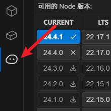

# NVM Node 版本管理器

  

    
    
<b>1：侧边栏</b> 在VS Code活动栏中点击此图标打开管理器

  

  

    
    
<b>2：底部状态栏</b> 显示当前Node版本，点击有列表弹窗

  

  

    
    
<b>3：弹窗</b> 弹出窗口显示已安装和可用版本列表

  

一个 Visual Studio Code 扩展，用于通过 NVM (Node Version Manager) 管理 Node.js 版本。

## 主要功能

### 🛠️ 版本管理
- 显示已安装的 Node.js 版本列表
- 一键切换当前使用的 Node.js 版本
- 支持删除已安装的版本
- 显示可用的 Node.js 版本列表
- 支持下载版本

### 🔍 自动版本检测
- 自动检测工作区中的 `.nvmrc` 文件
- 当 `.nvmrc` 不存在时，检查 `package.json` 中的引擎要求
- 根据项目配置智能推荐 Node.js 版本

### 🌐 多数据源支持
- 从本地 NVM 获取版本列表
- 从 Node.js 官方源获取版本
- 从 npmmirror 镜像源获取版本

## 🚀 安装与使用

### 安装步骤
1. 通过 VS Code 扩展市场搜索 "NVM Node Switch" 安装
2. 确保系统已安装 NVM (Node Version Manager)

### 使用说明
1. 安装扩展后，在 VS Code 活动栏中会出现 "Node Version Manager" 图标
2. 点击图标打开管理面板，包含以下视图：
   - **NVM版本**：显示当前 NVM 版本
   - **.nvmrc检查**：显示当前项目的 .nvmrc 文件状态
   - **推荐版本**：根据项目配置推荐的 Node.js 版本
   - **已安装版本**：列出所有已安装的 Node.js 版本
   - **可用版本**：显示可下载的 Node.js 版本

3. 基本操作：
   - **切换版本**：点击已安装版本列表中的版本号
   - **安装版本**：在可用版本列表中点击下载图标
   - **删除版本**：在已安装版本列表中点击删除图标
   - **创建.nvmrc**：当检测到项目没有.nvmrc文件时，会提示创建

4. 版本源切换：
   - 在可用版本列表顶部，可通过下拉菜单选择数据源：
     - 从nvm获取（默认）
     - 从nodejs官方获取
     - 从npmmirror镜像获取

## ⚙️ 技术特点
- 响应式 Webview 界面
- 支持 Windows/macOS/Linux 多平台
- 实时状态更新
- 错误处理和加载状态指示